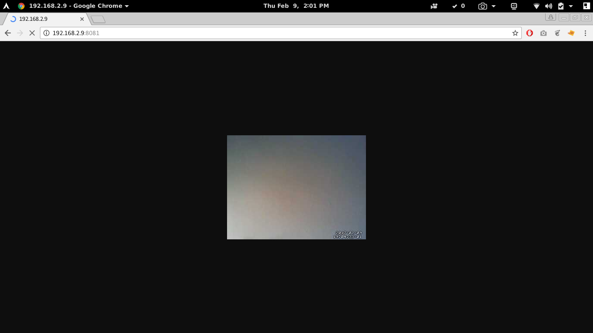

### Configuración de motion

Creamos un directorio para guardar las imagenes:

```bash
pi@raspberrypi:~ $ mkdir  /home/pi/Monitor
pi@raspberrypi:~ $ sudo chgrp motion /home/pi/Monitor
pi@raspberrypi:~ $ sudo chmod g+rwx /home/pi/Monitor
pi@raspberrypi:~ $ sudo chmod -R g+w /home/pi/Monitor/
```
Instalamos la librería **motion**.

```bash
pi@raspberrypi:~ $ sudo apt-get install -y motion
```
Editamos el archivo motion.conf, buscando los siguientes campos y los cambiamos a lo siguientes valores:

```bash
pi@raspberrypi:~ $ sudo nano /etc/motion/motion.conf
```
	stream_localhost off
	webcontrol_localhost off
	framerate 60
	target_dir /home/pi/Monitor
	
	
Editamos el archivo **/etc/default/motion** y cambiamos de **no** a **yes**

```bash
pi@raspberrypi:~ $ sudo nano /etc/default/motion
```
	start_motion_daemon=yes

Despues ejecutamos lo siguiente:

	pi@raspberrypi:~ $ sudo service motion stop
	pi@raspberrypi:~ $ sudo service motion start
	
Y Accedemos a la imagen de la cámara a traves de la url desde nuestro buscador: http://{your-rpi-address}:8081/ 

Obteniendo lo siguiente:

 


Las imagenes y videos pueden llenar el almacenamiento, por ello configuramos que pasada los 15 minutos despues de cada hora borre todos excepto las 20 ultimas imagenes:

```bash
pi@raspberrypi:~ $ sudo crontab -e
```


	15 * * * * (date; ls /home/pi/Monitor/*.jpg | head -n -20 | xargs rm -v) >> /tmp/images_deleted 2>&1


### Configurando el Servidor

Domo/models.py

```python
from __future__ import unicode_literals

from django.db import models

STATUS_CHOICES = (
    ('F', 'Forward'),
    ('B', 'Backward'),
    ('L', 'Left'),
    ('R', 'Right'),
    ('S', 'Stop')
)

# Create your models here.

class Motor(models.Model):
    date_created = models.DateTimeField(auto_now=True)
    status = models.CharField(max_length=1, choices=STATUS_CHOICES, default='S')

```
Domo/serializers.py:

```python	

from rest_framework import serializers

from Domo.models import Motor

class MotorSerializer(serializers.ModelSerializer):
    class Meta:
        model = Motor
        fields = ('date_created', 'status')

```	

Domo/views.py:

```python
from django.shortcuts import render
from rest_framework import viewsets

# Create your views here.
from Domo.models import Motor
from Domo.serializers import MotorSerializer

class MotorViewSet(viewsets.ModelViewSet):
    queryset = Motor.objects.all()
    serializer_class = MotorSerializer
```
	
Domo/admin.py

```python
from django.contrib import admin
from Domo.models import Motor

# Register your models here.
@admin.register(Motor)
class MotorAdmin(admin.ModelAdmin):
    list_display = ('date_created', 'status')
```
	

Domo/urls.py 

```python
from rest_framework import routers
from Domo.views import MotorViewSet

router = routers.DefaultRouter()
router.register(r'motors', MotorViewSet)

urlpatterns = router.urls
```
	
templates/index.html

	
```html
<!DOCTYPE html>
<html>
<head>
    <meta charset="UTF-8">
    <title>Proyecto</title>
</head>

<body>

<div style="text-align:center;margin:auto;">
    <button onclick="forward()">Avanzar</button>
</div>

<div style="text-align:center;margin:auto;">
    <button onclick="backward()">Retroceder</button>
</div>

<div style="text-align:center;margin:auto;">
    <button onclick="left()">Izquierda</button>
</div>

<div style="text-align:center;margin:auto;">
    <button onclick="right()">Derecha</button>
</div>

<div style="text-align:center;margin:auto;">
    <button onclick="stop()">Parar</button>
</div>


</body>
<script src="http://ajax.googleapis.com/ajax/libs/jquery/2.0.0/jquery.min.js"></script>
<script type="text/javascript">

    var ip = location.host;
    document.getElementById("ip_link").src = "http://"+ip+":8081";

    // Load all posts on page load
    function move(state) {
        $.ajax({
            url: "/api/motors/", // the endpoint
            type: "POST", // http method
            // handle a successful response
            success: function (data) {

	        },
            data: {
               	'date_created': new Date(),
                'status': state
            },
            // handle a non-successful response
            error: function (xhr, errmsg, err) {

                }
            });

        };

    function forward(){
    	move('F');
    };

    function backward(){
    	move('B');
    };

    function left(){
    	move('L');
    };

    function right(){
    	move('R');
    };

    function stop(){
    	move('S');
    };

</script>
</html>
```